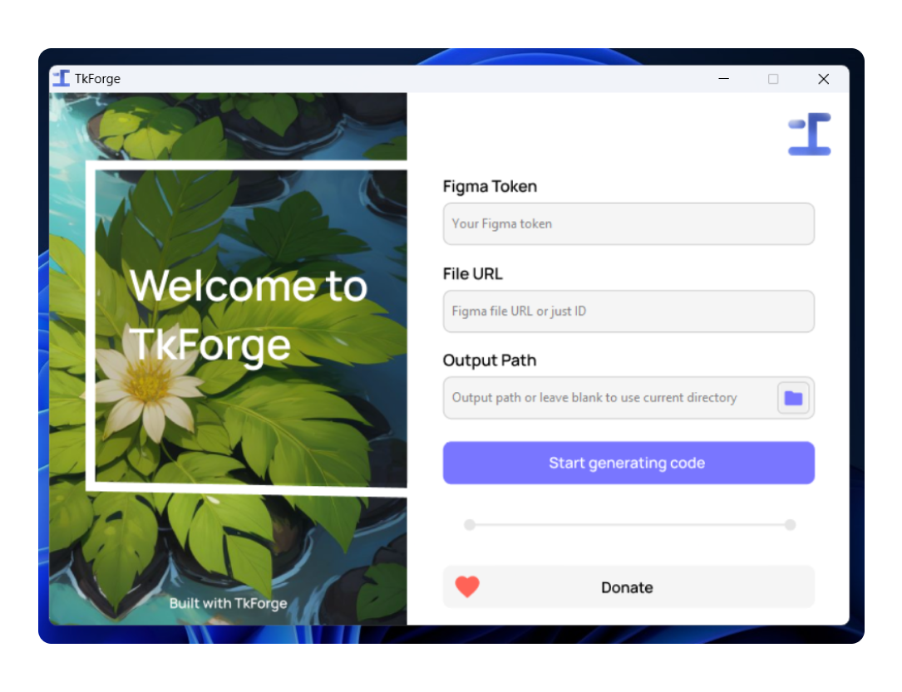

<p align="center"></p>

<p align="center"><strong>TkForge</strong></p>

<p align="center">Drag & drop in Figma to create a Python GUI with ease</p>

<p align="center"><a href="https://producthunt.com/products/tkforge">Upvote on Product Hunt</a> • <a href="https://patreon.com/axorax">Donate</a></p>

<p align="center"><a href="./README.md">English</a> • <a href="./README_zh.md">中文</a></p>

<p align="center"><strong>📺 YouTube video: <a href="https://youtu.be/lo6Ee_k_zG0">https://youtu.be/lo6Ee_k_zG0</a></strong></p>

## 📰 Table of Contents

- [Why and how?](#-why-and-how)
- [App Preview](#-app-preview)
- [Features](#-features)
- [Usage Guide](#-usage-guide)
- [Available names](#-available-names)
- [Names that have unique features](#-names-that-have-unique-features)
- [CLI Usage Guide](#-cli-usage-guide)
- [Add the CLI exe to the environment variables in Windows](#-add-the-cli-exe-to-the-environment-variables-in-windows)

## ❓ Why and how?

Something like this has already been done by ParthJadhav with Tkinter Designer but I liked the concept and wanted to make something similar if not better from scratch. TkForge interacts with the Figma API to get the details of the file and turns that into code. First, it gets the file data and converts it into a format that only has the necessary details then that is converted into code. This project took me a lot longer than I had anticipated.

## 💻 App Preview



## 🔥 Features

- Super easy to use
- Drag and drop GUI maker
- Support for placeholder text
- Support for more than one frame
- Automatically sets foreground to either black or white depending on the background (not always accurate)

## ✨ Usage Guide

First, you need to download the executable from the releases page. Then, you need to create a Figma token and copy the url of your project. Then, open the app and paste the token and url of your project into the app and click the button to start the magic! 🪄

In the Figma project, make sure to add proper names for all of your elements.

## 🧿 Available names

| Name                                   | Tkinter Element  | 2nd Argument (text after space) |
| -------------------------------------- | ---------------- | ------------------------------- |
| `text` (you can also name it anything) | canvas text      | -                               |
| `button`                               | button           | -                               |
| `image`                                | canvas image     | image file name                 |
| `textbox`                              | entry            | placeholder text                |
| `textarea`                             | text             | placeholder text                |
| `spinbox`                              | spinbox          | -                               |
| `rectangle`                            | canvas rectangle | -                               |
| `circle`                               | canvas circle    | -                               |
| `oval`                                 | canvas oval      | -                               |
| `line`                                 | canvas line      | -                               |
| `label`                                | label            | -                               |
| `scale`                                | scale            | FROM TO ORIENT                  |
| `listbox` (Read below before using)    | listbox          | -                               |

If any element starts with these names then it will be considered as that Tkinter element. For example; `rectangle 1`, `rectangle`, `Rectangle`, `RecTanGle 69` will all be considered as a rectangle. The capitalization does not matter.

## 💎 Names that have unique features

### • `label`

You can use label instead of text if you want to change that text later on.

### • `image`

You can set a name for the image file like this `image myImage`. The image will be created with the name `myImage.png`

### • `circle` and `oval`

Oval and circle act in the same way so you can use either one of those.

### • `circle`, `oval`, `rectangle` and `line`

Stroke color and stroke width are supported that means if you add a stroke to them in Figma, they will appear with that stroke and stroke width in the Tkinter design as well.

### • `textarea` and `textbox`

To add placeholder text, simply include it after the element name and a space. For instance, `textbox Hello world` or `textarea Hello world`. To set the placeholder text color, add `placeholder_fg="color_here"`. Example:

```python
textbox_1 = TkForge_Entry(
    placeholder="Code Example",
    placeholder_fg="#fff"
)
```

Use `textbox_1.is_placeholder(False)` to ensure inserted text doesn't inherit the placeholder color. Retrieve the placeholder text with `textbox_1.get_placeholder()`. Placeholder text may require additional handling for various situations.

### • `scale`

For the from, to and orient values of the scale element you can put them after the name one after the other separated by spaces. For example; if I want a scale that has from=10, to=50 and orient=HORIZONTAL then I can do `scale 10 50` or `scale 10 50 HORIZONTAL` and if I want orient=VERTICAL then `scale 10 50 VERTICAL`

### • `listbox`

It's recommended to avoid using `listbox` as it distorts height and width by a few pixels. Figma units don't work properly so I had to divide them by specific numbers to approximate the Figma look.

## 🔮 CLI Usage Guide

If you want to run it from the Python file then use `python tkforge.py YOUR_ARGUMENTS_HERE`

You can use `tkforge --help` to get the help command. If you're using the Python file, use `python tkforge.py --help`

You may need to use `./tkforge.exe` or something similar if you haven't added the CLI executable to the environment variables.

Here are some example usages:

### Flag-based Syntax

```
tkforge --id my_id --token my_token --out ./app
```

You can use any one of the command below if you want the output to be in the current directory:

```
tkforge --id my_id --token my_token --out .
```

```
tkforge --id my_id --token my_token
```

### Positional Syntax

```
tkforge my_id my_token output_path
```

You can use any one of the command below if you want the output to be in the current directory:

```
tkforge my_id my_token .
```

```
tkforge my_id my_token
```

## 🪟 Add the CLI exe to the environment variables in Windows

Step 1: Create a folder with any name like "tkforge"

Step 2: Put the TkForge CLI exe file in that folder

Step 3: Rename the exe from `tkforge-cli.exe` to `tkforge.exe`

Step 4: Copy the path name.

Example copied path name: `C:\Users\PC\Downloads\tkforge`

Do not copy the path for the ".exe", copy the path for the folder.

If the path name has quotes on both sides like this `"C:\Users\PC\Downloads\tkforge cli"`, then make sure to remove the quotes.

Step 5: Open the "Edit the system environment variables" app

Step 6: Click on "Environment Variables..." then on "System variables" click "Path"

Step 7: Then, click "Edit" then "New" and paste the path

Step 8: Click "Ok", "Ok" and "Ok" and you should be done!

---

<p align="center"><a href="https://www.patreon.com/axorax">Support me on Patreon</a> — <a href="https://github.com/axorax/socials">Check out my socials</a></p>