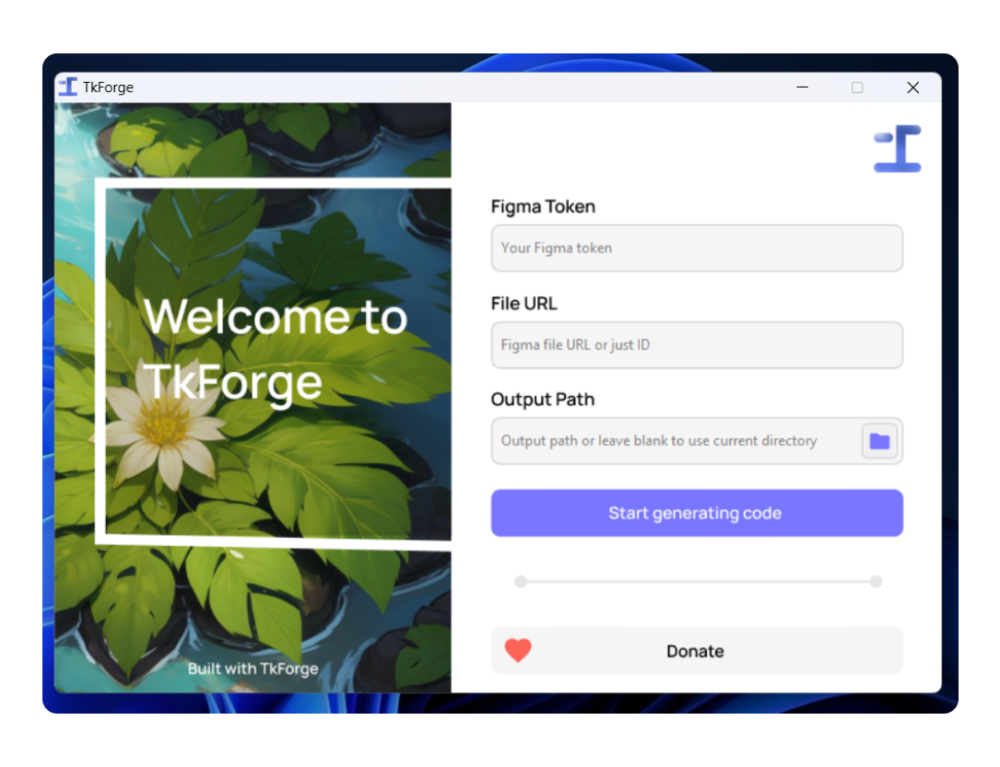

<p align="center"></p>

<p align="center"><strong>TkForge</strong></p>

<p align="center">Перетаскивание в Figma для легкого создания Python GUI</p>

<p align="center"><a href="https://producthunt.com/products/tkforge">Проголосовать на Product Hunt</a> • <a href="https://patreon.com/axorax">Пожертвовать</a></p>

<p align="center"><a href="./README.md">English</a> • <a href="./README_zh.md">中文</a> • <a href="./README_ru.md">Русский</a></p>

> [!IMPORTANT]
> Пожертвуйте или спонсируйте проект, чтобы помочь ему расти и становиться лучше! (https://patreon.com/axorax)
>
> Translated by SiresMacro (@siresmacro in Discord)

## 📰 Содержание

- [Почему и как?](#-почему-и-как)
- [Предварительный просмотр приложения](#-предварительный-просмотр-приложения)
- [Возможности](#-возможности)
- [Сделано с TkForge](#-сделано-с-tkforge)
- [Руководство по использованию](#-руководство-по-использованию)
- [Доступные имена](#-доступные-имена)
- [Имена с уникальными возможностями](#-имена-с-уникальными-возможностями)
- [Руководство по использованию CLI](#-руководство-по-использованию-cli)
- [Добавление CLI exe в переменные среды в Windows](#-добавление-cli-exe-в-переменные-среды-в-windows)

## ❓ Почему и как?

Что-то подобное уже было создано ParthJadhav с Tkinter Designer, но мне понравилась концепция, и я хотел создать что-то похожее, если не лучше, с нуля. TkForge взаимодействует с API Figma, чтобы получить детали файла и превратить их в код. Вы можете посмотреть мое видео об этом, чтобы узнать больше :)

## 💻 Предварительный просмотр приложения



## 🔥 Возможности

- Очень простое в использовании
- Создание GUI методом перетаскивания
- Поддержка текста-заглушки
- Поддержка более одного фрейма
- Автоматически устанавливает передний план в черный или белый цвет в зависимости от фона (не всегда точно)
- Хеширование изображений

## 🐍 Сделано с TkForge

Присоединяйтесь к нашему [Discord серверу](https://discord.gg/nKUFghjXQu) и размещайте/просматривайте приложения, созданные с помощью TkForge!

## ✨ Руководство по использованию

Сначала вам нужно скачать исполняемый файл со страницы релизов. Затем вам нужно создать токен Figma и скопировать URL вашего проекта. После этого откройте приложение, вставьте токен и URL вашего проекта в приложение и нажмите кнопку, чтобы начать магию! 🪄

Убедитесь, что ваш проект Figma использует фреймы. TkForge превращает содержимое внутри фреймов в работающие GUI и игнорирует все, что не находится во фрейме.

В проекте Figma убедитесь, что добавили правильные имена для всех ваших элементов.

## 🧿 Доступные имена

| Имя                                    | Элемент Tkinter  | 2-й аргумент (текст после пробела) |
| -------------------------------------- | ---------------- | ---------------------------------- |
| `text` (можно также назвать как угодно) | canvas text      | -                                  |
| `button`                               | button           | -                                  |
| `image`                                | canvas image     | имя файла изображения              |
| `textbox`                              | entry            | текст-заглушка                     |
| `textarea`                             | text             | текст-заглушка                     |
| `spinbox`                              | spinbox          | -                                  |
| `rectangle`                            | canvas rectangle | -                                  |
| `circle`                               | canvas circle    | -                                  |
| `oval`                                 | canvas oval      | -                                  |
| `line`                                 | canvas line      | -                                  |
| `label`                                | label            | -                                  |
| `scale`                                | scale            | FROM TO ORIENT                     |
| `listbox` (читайте ниже перед использованием) | listbox          | -                                  |

Если любой элемент начинается с этих имен, то он будет считаться соответствующим элементом Tkinter. Например; `rectangle 1`, `rectangle`, `Rectangle`, `RecTanGle 69` все будут считаться прямоугольником. Регистр не имеет значения.

## 💎 Имена с уникальными возможностями

### • `label`

Вы можете использовать label вместо text, если хотите изменить этот текст позже.

### • `image`

Вы можете задать имя для файла изображения таким образом: `image myImage`. Изображение будет создано с именем `myImage.png`

### • `circle` и `oval`

Oval и circle работают одинаково, поэтому вы можете использовать любой из них.

### • `circle`, `oval`, `rectangle` и `line`

Поддерживаются цвет обводки и ширина обводки, что означает, что если вы добавите обводку к ним в Figma, они появятся с этой обводкой и шириной обводки в дизайне Tkinter тоже.

### • `textarea` и `textbox`

Чтобы добавить текст-заглушку, просто включите его после имени элемента и пробела. Например, `textbox Hello world` или `textarea Hello world`. Чтобы установить цвет текста-заглушки, добавьте `placeholder_fg="цвет_здесь"`. Пример:

```python
textbox_1 = TkForge_Entry(
    placeholder="Пример кода",
    placeholder_fg="#fff"
)
```

Используйте `textbox_1.is_placeholder(False)`, чтобы убедиться, что вставленный текст не наследует цвет заглушки. Получите текст-заглушку с помощью `textbox_1.get_placeholder()`. Текст-заглушка может потребовать дополнительной обработки для различных ситуаций.

### • `scale`

Для значений from, to и orient элемента scale вы можете поместить их после имени один за другим, разделенные пробелами. Например; если я хочу scale с from=10, to=50 и orient=HORIZONTAL, то я могу написать `scale 10 50` или `scale 10 50 HORIZONTAL`, а если я хочу orient=VERTICAL, то `scale 10 50 VERTICAL`

### • `listbox`

Рекомендуется избегать использования `listbox`, поскольку он искажает высоту и ширину на несколько пикселей. Единицы Figma работают неправильно, поэтому мне пришлось разделить их на конкретные числа, чтобы приблизиться к внешнему виду Figma.

## 🔮 Руководство по использованию CLI

Если вы хотите запустить его из файла Python, используйте `python tkforge.py ВАШИ_АРГУМЕНТЫ_ЗДЕСЬ`

Вы можете использовать `tkforge --help`, чтобы получить команду помощи. Если вы используете файл Python, используйте `python tkforge.py --help`

Вам может потребоваться использовать `./tkforge.exe` или что-то подобное, если вы не добавили исполняемый файл CLI в переменные среды.

Вот некоторые примеры использования:

### Синтаксис на основе флагов

```sh
tkforge --id "my_id" --token "my_token" --out ./app
```

Вы можете использовать любую из команд ниже, если хотите, чтобы вывод был в текущем каталоге:

```sh
tkforge --id "my_id" --token "my_token"

tkforge --id "my_id" --token "my_token" --out .
```

### Позиционный синтаксис

```sh
tkforge "my_id" "my_token" output_path
```

Вы можете использовать любую из команд ниже, если хотите, чтобы вывод был в текущем каталоге:

```sh
tkforge "my_id" "my_token"

tkforge "my_id" "my_token" .
```

## 🪟 Добавление CLI exe в переменные среды в Windows

https://github.com/user-attachments/assets/f87c6df1-3f9a-442c-a28b-a947b7c7b1f4

---

<p align="center"><a href="https://www.patreon.com/axorax">Поддержите меня на Patreon</a> — <a href="https://github.com/axorax/socials">Посмотрите мои социальные сети</a></p>
